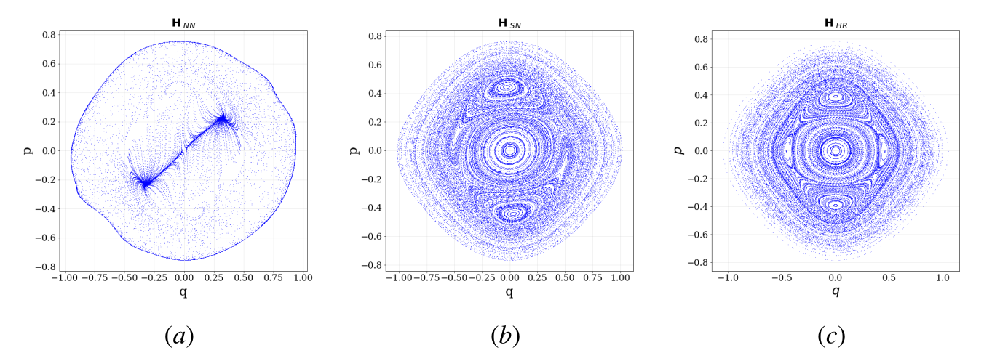
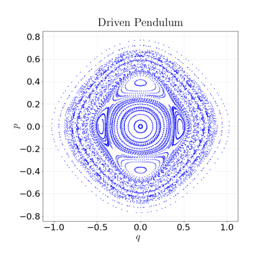

# 🖼️ **Time-Reversible Neural Networks**

*Learning Hamiltonian Dynamics with symlectic time-reversible neural networks*

Creator: [Riccardo Valperga](https://twitter.com/RValperga).

[](https://opensource.org/licenses/MIT)
[](https://www.python.org/downloads/release/python-390/)
[](https://github.com/psf/black)

(a) Simple MLP. (b) Symplectic Neural Networks. (c) Time-reversible neural networks (ours).

##

A JAX-based implementation of time-reversible neural networks from [Valperga et al. 2022](https://arxiv.org/abs/2204.12323)

<!-- TABLE OF CONTENTS -->

<details open="open">
  <summary>Table of Contents</summary>
  <ol>
    <li>
      <a href="#installation">Installation</a>
    </li>
    <li>
      <a href="#driven pendulum">The driven pendulum example</a>
    </li>
    <li>
      <a href="#structure">Structure of the repo</a>
    </li>
    <li>
      <a href="#usage">Usage</a>
      <ul>
        <li><a href="#training">Training</a></li>
        <li><a href="#running">Running</a></li>
      </ul>
    </li>
    <li><a href="#license">License</a></li>
    <li><a href="#contact">Contact</a></li>
  </ol>
</details>

## Installation

Setup an environment with `python>=3.9` (earlier versions have not been tested).

The following packages are installed very differently based on the system configuration being used. For this reason, they are not included in the `requirements.txt` file:

- `jax >= 0.4.11`. See [Official Jax installation guide](https://github.com/google/jax#installation) for more details.
- `pytorch`. CPU version is suggested because it is only used for loading the data more. See [Official Pytorch installation guide](https://pytorch.org/get-started/locally/).

_After_ having installed the above packages, run:

```bash
pip install -r requirements.txt
```

These are all the packages used to run.

## The driven pendulum example

<p align="center">
  
</p>

Consider the time-periodic Hamiltonian

$$H(p, q, t) = \frac{1}{2} p^2 - \nu^2 \cos(q) - \lambda \left[ 0.3pq \sin(2t) + 0.7pq \sin(3t) \right]$$


This Hamiltonian represents a simple pendulum with natural frequency ν driven by a $2π$-periodic force. The time-$2π$ map of this system defined by the flow $Φ\_{2π}$ is usually also referred to as a Poincaré map as one could view time as an augmented phase space coordinate and $t = 2π$ can be considered a surface of section in the extended phase space $(p, q, t)$. A Poincar´e plot of     this map is depicted in the figure.

## Structure of the repo

The repository is structured as follows:

- `./config`. Configuration files for the tasks.
- `./pendulum_data`. Dataset of state space variables from a simulated driven pendulum.
- `./dataset`. **Package** that generates the dataset.
- `./models`. **Package** of the models. It includes Hénon maps and normalizing flows.
- `train.py`. Train time-reversible neural networks.
- `test.py`. Tests forecasting.

## Usage

### Training

From the root folder run:

```bash
python train.py --config=config/config.py:train --config.wandb.wandb_log=False --config.dataset.batch_size=150 --config.dataset.train_lines=150 --config.dataset.num_lines=200 --config.model.num_layers_flow=5 --config.model.num_layers=2 --config.model.num_hidden=32 --config.model.d=1 --config.train.num_epochs=10000 --config.train.lr=0.001 --config.seed=42
```

In particular:

- `-config.wandb.wanbb_log=False`: Wandb logging.

- `--config.dataset.train_lines=150`: with this, we use the first 150 lines in the `./pendulum_data` as training points.

- `--config.dataset.batch_size=150`: the traoning batch size. In this case it is full-batch.

- `--config.dataset.num_lines=200`: the total number of points in `./pendulum_data`. In this case 50 points will be used for evaluation.

- `--config.model.num_layers_flow=5 `: number of layers in the flow.

- `--config.model.num_layers=2`: number of layers in the MLP used to construct flow layers.

### Testing

To test the trained model:

```bash
python test.py --config=config/config.py:test_last --config.model.num_layers_flow=5 --config.model.num_layers=2 --config.model.num_hidden=32 --config.model.d=1
```

Checkpoint from training are saved in `./checkpoints` using date and time as name. `-config=config/config.py:test_last` runs the most recent one. To run a specific one use, for example `-config=config/config.py:test_last --config.date_and_time = "2023-10-10_19-15-40"`.

## License

Distributed under the MIT License. See `LICENSE` for more information.

## Contact

[Riccardo Valperga](https://twitter.com/RValperga)
